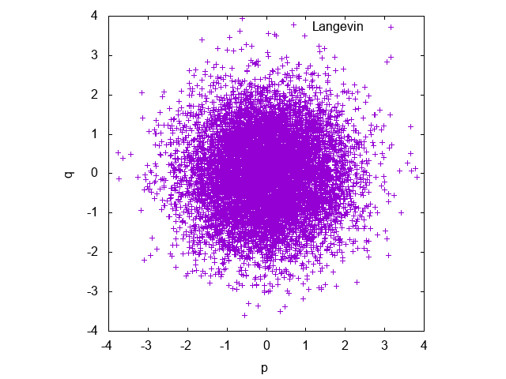

[Japanese](README_ja.md)/ English

# Ergodicity of a thermostated harmonic oscillator

## Summary

Examples of harmonic oscillators with several thermostats.

## Thermostats

* Nose-Hoover (NH)
* Langevin
* Kinetic-Moments method (KM)
* Nose-Hoover-Chain (NHC)

## Integration Scheme

* The 4th-order Runge-Kutta for deterministic thermostats (NH, KM, and NHC).
* The first-order Euler method for the Langevin method.

## Usage

```
$ make
$ gnuplot plot.plt
```

## Results

* Cumulative Distribution Functions of Energy


You can see that the system with Nose-Hoover doses not achieve the canonical distribution while the systems with other thermostats does.

* Phase Space of the Nose-Hoover method


* Phase Space of the Langevin method



* Phase space of the Kinetic-Moments method


* Phase space of the Nose-Hoover-Chain method.


## References

* Nose-Hoover method: W. G. Hoover, Phys. Rev. A 31, 1695 (1985).
* Langevin method: M. P. Allen and D. J. Tildesley, Computer Simula-
tion of Liquids (Oxford University Press, 1989), ISBN
0198556454.
* Kinetic-Moments method: W. G. Hoover and B. L. Holian, Phys. Lett. A 211, 253
(1996).
* Nose-Hoover-Chain method: G. J. Martyna, M. L. Klein, and M. Tuckerman, The
Journal of Chemical Physics 97, 2635 (1992).
* Ergodicity of the harmonic-oscillator: H. Watanabe and H. Kobayashi, Phys. Rev. E 75, 040102
(2007).
