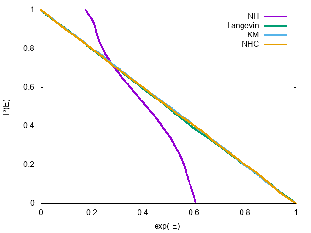

Japanese/ [English](README.md)

# 調和振動子に作用させた熱浴のエルゴード性

## 概要

分子動力学法において調和振動子にNose-Hoover熱浴をつけるとエルゴード性を失い、カノニカル分布にならないことが知られている。それを解決する手段として、Kinetic-Moments法、Nose-Hoover-Chain法などの多変数熱浴や、Langevin法などの確率的熱浴をつける方法が知られている。そのサンプルコード。

Qiitaに解説を書いたので、そちらも参照のこと。

* [調和振動子に作用させた熱浴のエルゴード性](http://qiita.com/kaityo256/items/2b14d7093c43eb5f77d7) @ [Qiita](http://qiita.com/)

## 熱浴法

* Nose-Hoover (NH)
* Langevin
* Kinetic-Moments method (KM)
* Nose-Hoover-Chain (NHC)

## 数値積分手法

* 決定論熱浴(NH, KM, NHC)については4次のRunge-Kutta法。
* Langevin熱浴については1次のEuler法

## 使用法

```
$ make
$ gnuplot plot.plt
```

## 結果

* エネルギーの累積分布関数


エネルギーEに関する累積分布関数P(E)は、逆温度をβとして1 - exp(-βE)となるはず。したがって、P(E)をexp(-βE)に関してプロットすると、カノニカル分布が実現していれば(1,0)と(0,1)をつなぐ直線になる。上のグラフはβ=1の場合に様々な熱浴においてP(E)をプロットしたもの。Langevin、KM、NHCでは直線に乗っており、指定温度のカノニカル分布が実現していることがわかるが、Nose-Hooverだけカノニカル分布からずれている。

* Npse-Hoover法の場合の位相空間。本来なら原点に近いほど密に、離れるほど疎に位相空間を埋め尽くさなければならないが、明らかにエネルギーに上限と下限がある。


* Langevin法の場合。原点に近いほど密に、離れるほど疎に位相空間を埋め尽くしており、正しく温度が制御されていることがわかる。


* Kinetic-Moments法も同様。


* Nose-Hoover-Chain法も同様。


## 参考文献

* Nose-Hoover method: W. G. Hoover, Phys. Rev. A 31, 1695 (1985).
* Langevin method: M. P. Allen and D. J. Tildesley, Computer Simula-
tion of Liquids (Oxford University Press, 1989), ISBN
0198556454.
* Kinetic-Moments method: W. G. Hoover and B. L. Holian, Phys. Lett. A 211, 253
(1996).
* Nose-Hoover-Chain method: G. J. Martyna, M. L. Klein, and M. Tuckerman, The
Journal of Chemical Physics 97, 2635 (1992).
* 調和振動子でエルゴード性が破れる証明： H. Watanabe and H. Kobayashi, Phys. Rev. E 75, 040102
(2007).
